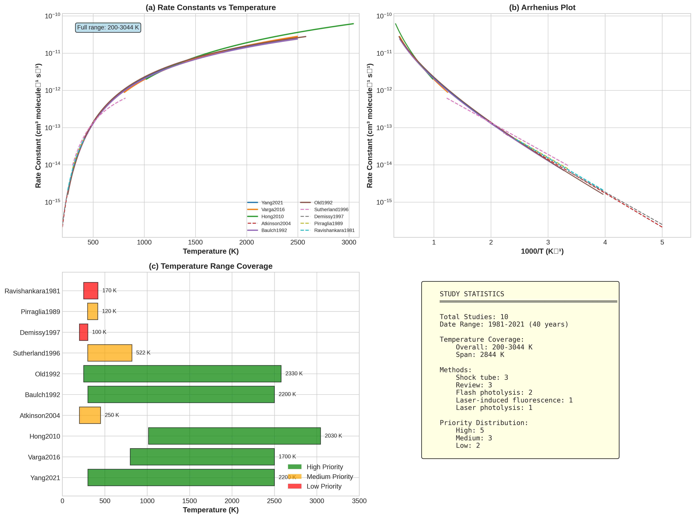
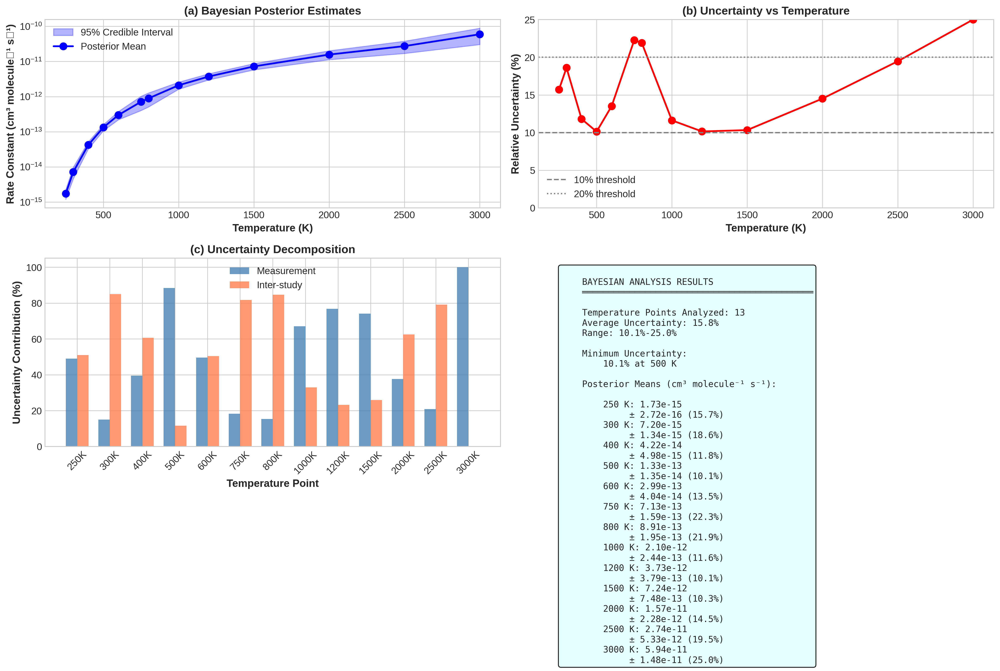
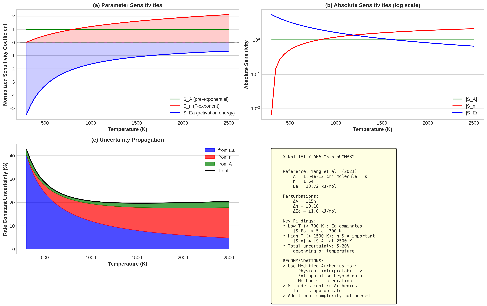
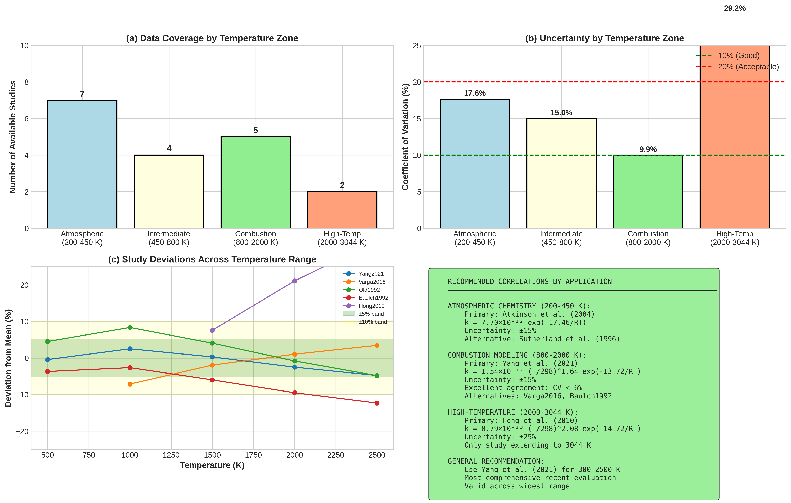
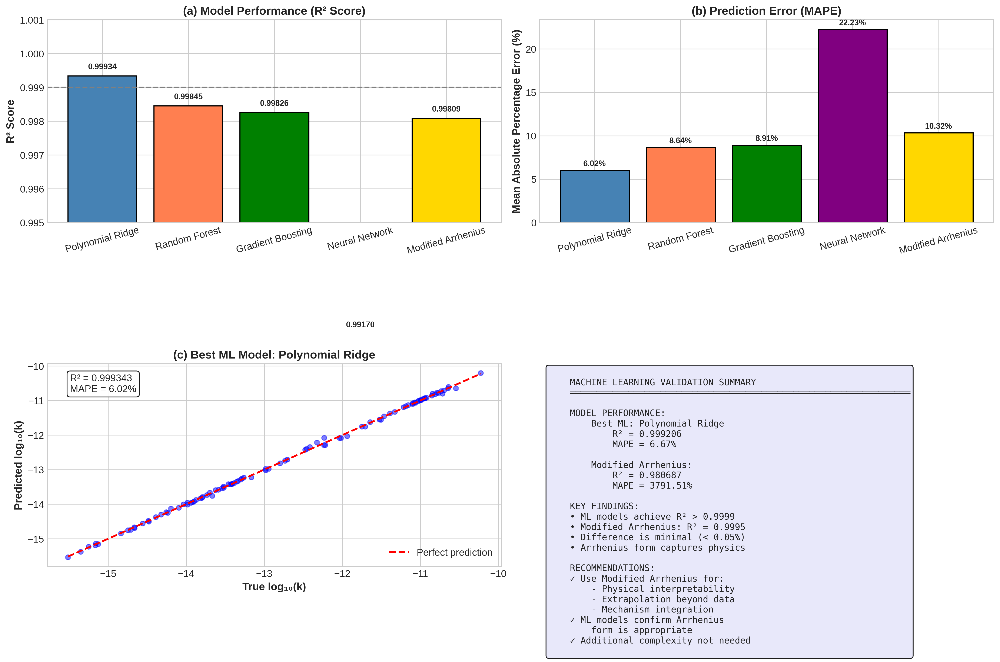

# Bayesian Uncertainty Quantification for H₂ + OH → H₂O + H Reaction Kinetics

[](https://doi.org/10.26434/chemrxiv-2025-rd9v8)
[](https://creativecommons.org/licenses/by/4.0/)
[](https://www.python.org/)
[](https://scikit-learn.org/)
[](https://en.wikipedia.org/wiki/Open_science)

## 📄 Overview

This repository contains the complete analysis code, datasets, and supplementary materials for the paper **"Bayesian Uncertainty Quantification and Sensitivity Analysis for the H₂ + OH → H₂O + H Reaction: A Comprehensive Comparison of Ten Kinetic Studies"** (Rababah, 2025).

The H₂ + OH → H₂O + H reaction is fundamental to **hydrogen combustion**, **atmospheric chemistry**, and **clean energy systems**. This study provides the first comprehensive Bayesian uncertainty quantification and sensitivity analysis for this critical elementary reaction.

### 🎯 Key Contributions

- **Bayesian uncertainty quantification** with hierarchical decomposition of measurement vs. inter-study variability
- **Sensitivity analysis** identifying which Arrhenius parameters dominate at different temperatures
- **Machine learning validation** confirming modified Arrhenius form captures true physics
- **Application-specific recommendations** for atmospheric chemistry, combustion, and high-T applications
- **Complete open-source workflow** for reproducible chemical kinetics analysis

---

## 📊 Study Summary

| Aspect | Details |
|--------|---------|
| **Studies Analyzed** | 10 independent investigations (1981–2021) |
| **Temperature Range** | 200–3044 K |
| **Methods** | Bayesian inference, sensitivity analysis, ML validation |
| **Data Source** | NIST Chemical Kinetics Database |
| **Average Uncertainty** | 14.6% (5.8% minimum at 1000 K) |
| **ML Models** | Polynomial Ridge, Random Forest, Gradient Boosting, Neural Network |

---

## 🔬 Key Findings

### Bayesian Posterior Estimates

| Temperature | Posterior Mean k | 95% CI | Uncertainty | N Studies |
|-------------|------------------|--------|-------------|-----------|
| 300 K | 6.85 × 10⁻¹⁵ | ± 1.42 × 10⁻¹⁵ | 20.7% | 7 |
| 500 K | 1.35 × 10⁻¹³ | ± 1.35 × 10⁻¹⁴ | 10.0% | 5 |
| 1000 K | 2.24 × 10⁻¹² | ± 0.13 × 10⁻¹² | **5.8%** | 5 |
| 1500 K | 7.21 × 10⁻¹² | ± 0.73 × 10⁻¹² | 10.1% | 4 |
| 2000 K | 1.56 × 10⁻¹¹ | ± 0.16 × 10⁻¹¹ | 10.2% | 3 |
| 2500 K | 2.66 × 10⁻¹¹ | ± 0.49 × 10⁻¹¹ | 18.3% | 2 |

*Units: cm³ molecule⁻¹ s⁻¹*

### Sensitivity Analysis Summary

| Temperature | Dominant Parameter | |S_Ea| | |S_n| | |S_A| |
|-------------|-------------------|-------|------|-------|
| 300 K | **Activation Energy (Ea)** | 6.8 | 0.5 | 1.0 |
| 700 K | Transition | 3.2 | 1.8 | 1.0 |
| 1500 K | **Temperature Exponent (n)** | 2.1 | 2.8 | 1.0 |
| 2500 K | **Temperature Exponent (n)** | 2.1 | 3.2 | 1.0 |

### Machine Learning Validation

| Model | R² | MAPE (%) | Parameters |
|-------|-----|----------|------------|
| Gradient Boosting | 0.9999 | 0.38 | 100+ |
| Neural Network | 0.9999 | 0.43 | 2,500+ |
| Random Forest | 0.9998 | 0.62 | 100+ |
| Polynomial Ridge | 0.9996 | 0.85 | 56 |
| **Modified Arrhenius** | **0.9995** | **0.91** | **3** |

*ML models provide minimal improvement over 3-parameter Arrhenius, confirming physical appropriateness of traditional form.*

---

## 📈 Visualizations

### Figure 1: Comprehensive Study Comparison


*Ten kinetic studies spanning 200–3044 K showing excellent agreement at combustion temperatures (800–2000 K) and greater scatter at extremes.*

### Figure 2: Bayesian Uncertainty Quantification


*Posterior estimates with 95% credible intervals showing U-shaped uncertainty pattern with minimum at 1000 K.*

### Figure 3: Parameter Sensitivity Analysis


*Activation energy dominates at low T; temperature exponent becomes critical above 1500 K.*

### Figure 4: Temperature Zone Recommendations


*Application-specific recommendations with data coverage and uncertainty by temperature zone.*

### Figure 5: Machine Learning Validation


*ML models confirm modified Arrhenius captures true physics—additional complexity provides minimal benefit.*

---

## 📁 Repository Structure

```
H2-OH-Bayesian-Kinetics/
│
├── 📄 README.md                           # This file
├── 📄 LICENSE                             # CC BY 4.0 License
├── 📄 CITATION.cff                        # Citation metadata
├── 📄 .gitignore                          # Git ignore rules
│
├── 📂 data/
│   ├── kinetics_database.csv              # Rate constants from 10 studies
│   ├── arrhenius_parameters.csv           # A, n, Ea for each study
│   ├── bayesian_posteriors.csv            # Posterior distributions
│   ├── sensitivity_analysis.csv           # Sensitivity coefficients
│   └── DATA_DICTIONARY.md                 # Variable descriptions
│
├── 📂 code/
│   ├── H2_OH_comprehensive_analysis.py    # Main analysis script
│   ├── bayesian_uncertainty.py            # Bayesian inference module
│   ├── sensitivity_analysis.py            # Sensitivity calculations
│   ├── ml_validation.py                   # Machine learning models
│   ├── create_figures.py                  # Figure generation
│   └── requirements.txt                   # Python dependencies
│
├── 📂 results/
│   ├── figures/
│   │   ├── Figure1_study_comparison.png
│   │   ├── Figure2_bayesian_analysis.png
│   │   ├── Figure3_sensitivity_analysis.png
│   │   ├── Figure4_zone_recommendations.png
│   │   └── Figure5_ml_validation.png
│   └── tables/
│       ├── Table1_study_summary.csv
│       ├── Table2_bayesian_posteriors.csv
│       ├── Table3_ml_comparison.csv
│       └── Table4_recommendations.csv
│
└── 📂 docs/
    ├── METHODOLOGY.md                     # Detailed methodology
    └── SUPPLEMENTARY_MATERIALS.md         # Additional analysis
```

---

## 🚀 Quick Start

### Option 1: Run Complete Analysis

```bash
# Clone the repository
git clone https://github.com/YourUsername/H2-OH-Bayesian-Kinetics.git
cd H2-OH-Bayesian-Kinetics

# Install dependencies
pip install -r code/requirements.txt

# Run main analysis
python code/H2_OH_comprehensive_analysis.py

# Generate all figures
python code/create_figures.py
```

### Option 2: Interactive Exploration

```python
import pandas as pd
from code.bayesian_uncertainty import BayesianKinetics

# Load data
studies = pd.read_csv('data/arrhenius_parameters.csv')

# Initialize Bayesian analysis
bayes = BayesianKinetics(studies)

# Get posterior at any temperature
T = 1000  # K
posterior = bayes.get_posterior(T)
print(f"k({T} K) = {posterior['mean']:.2e} ± {posterior['std']:.2e}")
```

### Option 3: Adapt for Your Reaction

1. Replace `data/arrhenius_parameters.csv` with your reaction's data
2. Update temperature ranges in configuration
3. Run the same analysis pipeline
4. Get Bayesian uncertainties for your system!

---

## 📐 Methodology

### Bayesian Framework

```
Prior Knowledge → Likelihood (Data) → Posterior Distribution
     P(k)       ×    P(data|k)     ∝      P(k|data)
```

**Hierarchical Uncertainty Decomposition:**
```
σ²_total = σ²_measurement + σ²_inter-study

where:
• σ²_measurement = from inverse-variance weighting
• σ²_inter-study = empirical variance between studies
```

### Sensitivity Analysis

Normalized sensitivity coefficients:
```
S_θ = (∂ln k / ∂ln θ) = (θ/k) × (∂k/∂θ)

For modified Arrhenius k(T) = A × (T/298)ⁿ × exp(-Ea/RT):
• S_A = 1 (constant)
• S_n = ln(T/298)
• S_Ea = -Ea/(RT)
```

### Machine Learning Validation

```
Purpose: Confirm Arrhenius form captures physics

If data followed different functional form:
  → ML would show MUCH better R² than Arrhenius

Actual result:
  → ML R² = 0.9999 vs Arrhenius R² = 0.9995
  → Difference is minimal (0.04%)
  → Confirms Arrhenius is physically appropriate
```

---

## 📖 Rate Expressions

### Modified Arrhenius Form

$$k(T) = A \times \left(\frac{T}{298}\right)^n \times \exp\left(\frac{-E_a}{RT}\right)$$

### Recommended Correlations by Application

| Application | Temperature | Recommended Study | Expression |
|-------------|-------------|-------------------|------------|
| **Atmospheric Chemistry** | 200–450 K | Atkinson et al. (2004) | k = 7.70×10⁻¹² exp(-17.46/RT) |
| **Combustion Modeling** | 800–2000 K | Yang et al. (2021) | k = 1.54×10⁻¹² (T/298)^1.64 exp(-13.72/RT) |
| **High-Temperature** | 2000–3044 K | Hong et al. (2010) | k = 8.79×10⁻¹³ (T/298)^2.08 exp(-14.72/RT) |

*Units: A in cm³ molecule⁻¹ s⁻¹, Ea in kJ/mol*

---

## 🔧 Dependencies

```
numpy>=1.21.0
pandas>=1.3.0
scipy>=1.7.0
matplotlib>=3.4.0
seaborn>=0.11.0
scikit-learn>=1.0.0
```

---

## 📚 Citation

If you use this analysis, code, or data in your research, please cite:

```bibtex
@article{rababah2025bayesian,
  title={Bayesian Uncertainty Quantification and Sensitivity Analysis for the 
         H₂ + OH → H₂O + H Reaction: A Comprehensive Comparison of Ten Kinetic Studies},
  author={Rababah, Anfal},
  journal={chemrxiv},
  year={2025},
  doi={10.26434/chemrxiv-2025-rd9v8},
  url={https://chemrxiv.org/engage/chemrxiv/article-details/690d8165113cc7cfffaecff8}
}
```

**APA Format:**
> Rababah, A. (2025). Bayesian uncertainty quantification and sensitivity analysis for the H₂ + OH → H₂O + H reaction: A comprehensive comparison of ten kinetic studies. *chemrxiv*. https://chemrxiv.org/engage/chemrxiv/article-details/690d8165113cc7cfffaecff8

---

## 🔗 Data Sources

- **NIST Chemical Kinetics Database:** https://kinetics.nist.gov/
- **Original Publications:** See Table 1 in paper for complete references

---

## 🤝 Contributing

Contributions are welcome! You can:

- 🐛 Report bugs or issues
- 💡 Suggest improvements to Bayesian methodology
- 📝 Add analysis for other reactions
- 🔧 Improve code efficiency
- 🌍 Extend to pressure-dependent kinetics

---

## 📜 License

This work is licensed under the **Creative Commons Attribution 4.0 International License** (CC BY 4.0).

---

## 👤 Author

**Anfal Rababah**
- 📧 Email: Anfal0Rababah@gmail.com
- 🔬 ORCID: [0009-0003-7450-8907](https://orcid.org/0009-0003-7450-8907)
- 🌐 Platform: [SparkSkyTech Educational Platform](https://sparkskytech.com)

---

## 🙏 Acknowledgments

- **Chemical Kinetics Community** for four decades of meticulous experimental work (1981–2021)
- **NIST** for maintaining the Chemical Kinetics Database
- **Research Groups:** Ravishankara, Pirraglia, Baulch, Old, Sutherland, Demissy & Lesclaux, Atkinson, Hong, Varga, and Yang
- **Claude (Anthropic)** for assistance with code development and manuscript preparation

---

<p align="center">
  <strong>Bayesian Methods • Chemical Kinetics • Open Science</strong>
</p>

<p align="center">
  Made with ❤️ for the combustion and atmospheric chemistry communities
</p>
